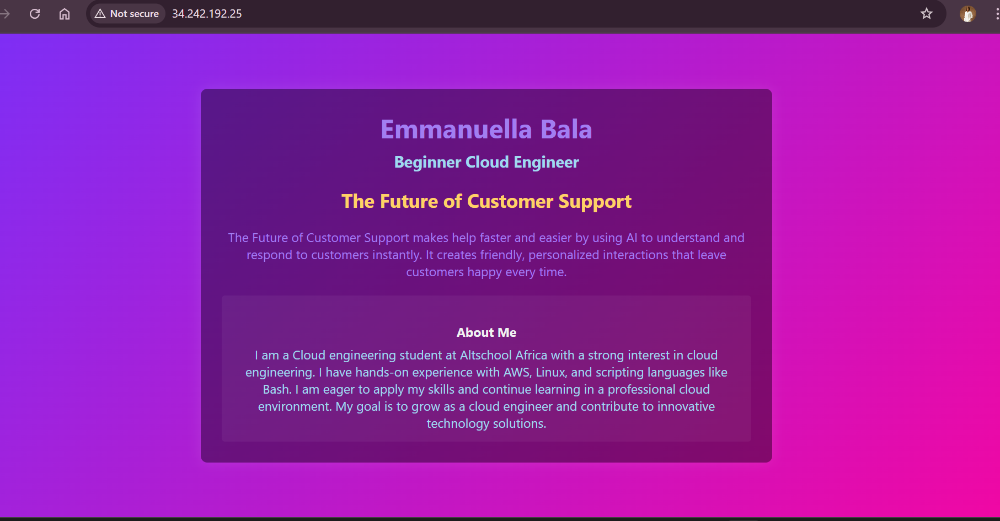

# 🚀 Cloud Engineering Second Semester Project for Emmanuella Bala

### Provision a Linux Server & Deploy a Dynamic Landing Page

The *AltSchool Cloud Engineering Second Semester Examination Project*.  
This project demonstrates cloud provisioning, web server configuration, and web deployment skills aimed at showcasing technical capability to potential investors.

---

## 📌 Project Objective

- Spin up an Ubuntu server (on AWS EC2)  
- Install Nginx and set up Node.js with reverse proxy  
- Create a landing page with HTML and CSS  
- Secure it with Let’s Encrypt SSL  
- Document everything in a GitHub repo  

---

## 📦 Technologies Used

- **Cloud Platform:** AWS EC2 (Ubuntu 22.04 LTS)  
- **Web Server:** Nginx  
- **App Runtime:** Node.js (with reverse proxy)  
- **VS Code:** HTML & CSS  
- **SSL:** Let’s Encrypt (via Certbot)  
- **Frontend Styling:** External CSS Animation  

---

## 🚀 Setup Steps

### 1. Provision the Server Setup with AWS

- Log into AWS console  
- Go to EC2 Dashboard  
- Choose Ubuntu Server 22.04 LTS  
- Create an instance (preferably Free Tier)  
- Create a new key pair  
- Create a new security group allowing:
  - Port **22** (SSH: Your IP)
  - Port **80** (HTTP: Anywhere)
  - Port **443** (HTTPS: Anywhere)  
- Launch instance and connect via SSH

---

### 2. Web Server Setup / Installing Packages

**SSH into your Ubuntu server**, then install the necessary packages:

## 🔧 Install Nginx
```bash
sudo apt update && sudo apt upgrade -y
sudo apt install nginx -y
```

## 🌐 Test Nginx
Visit: http://34.242.192.25
You should see the default Nginx welcome page.

### 🔁 Set Up Reverse Proxy with Node.js

## Install Node.js:
``` bash
curl -fsSL https://deb.nodesource.com/setup_20.x | sudo -E bash -
sudo apt install -y nodejs
```

# Sample Node.js app
```bash
mkdir myapp  &&  cd myapp
npm init -y
npm install express
nano index.js
```

# Start it
```bash
node index.js
```

# Configure Nginx as a reverse proxy
```bash
sudo nano /etc/nginx/sites-available/default
sudo nginx -t && sudo systemctl restart nginx
```


### 3. Create a Dynamic Landing Page

# Start with creating a folder
Create a folder with two files inside.
Index.html
style.css

# Edit files with VSCode
Write out your html code in index.html
Write out your external styling in style.css
use : <link rel="stylesheet" href="style.css">
To connect the two files together.


# use WinSCP and PUTTYgen to connect your files to your Ubuntu server
Navigate into /var/www/html
Move your files individually index.html and style.css


### 4. Network and security set up

# Enable HTTPS with Let’s Encrypt 
```bash
sudo apt install certbot python3-certbot-nginx -y
sudo certbot --nginx
```

### 5. Document everything on a Github Repo
Create a Github Repo and ReadMe File
Log unto git and create a repo
Using VSCode create a readme.md file
Using git init, commit and push my readme file to github.

### My IP Address.
http://34.242.192.25

### A VIEW OF MY DYNAMIC LANDING PAGE


## 👤 Author
**EMMANUELLA BALA**  
Cloud Engineering student at ALTSCHOOL africa

